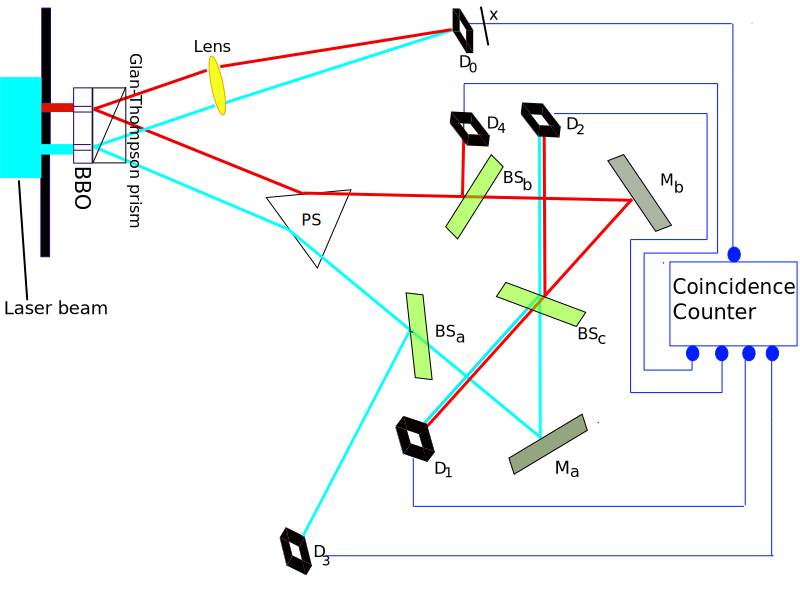
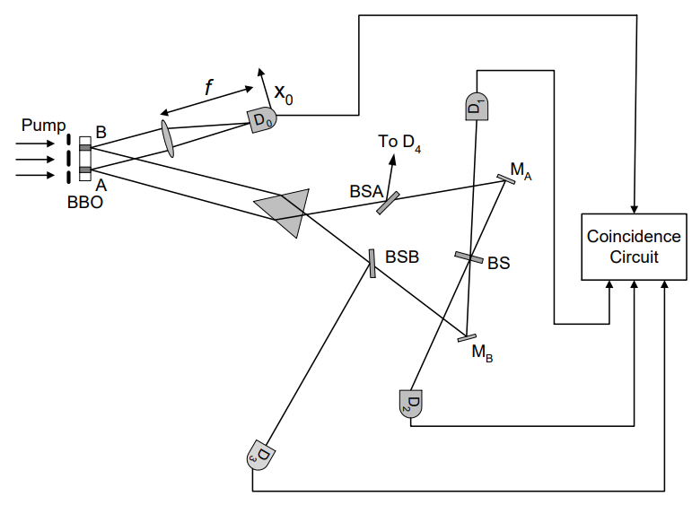
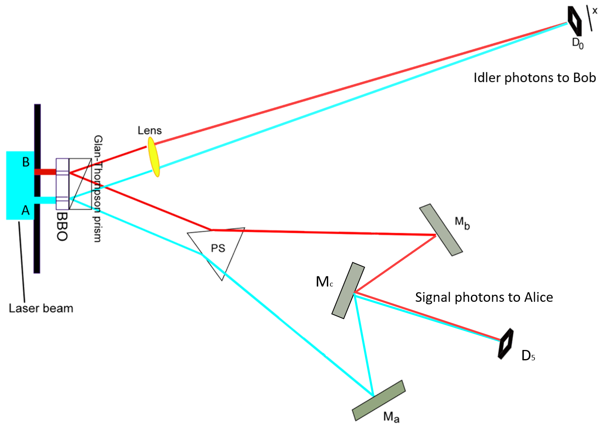

# Faster than light communication?

Written on 02.08.2021

When you see the title, you probably think that this is not gonna work, because you learned that the ultimate speed limit of the universe is the speed of light (actually every 
massless object will travel in this speed in the vaccuum). Massive object moving faster than light is impossible as shown in Einstein's special relativity. More importantly, 
moving faster than light or sending information faster than light can reach the receiver will violate the sacred law of causality. So, superluminal communication is never gonna 
work and it is just a waste of time to even think about it.

However, maybe you will change your mind after reading this to the end.

Before I start to talk about the experiment setup that seems possible to let us communicate faster than light (FTL), I think we first need to understand the famous delayed choice quantum eraser ([DCQE](https://en.wikipedia.org/wiki/Delayed-choice_quantum_eraser)) experiment, because the FTL-communication setup is based on the setup and understanding of the DCQE experiment. For people who is unfamiliar with the DCQE experiment, I recommend you to watch the videos from [PBS Spacetime](https://www.youtube.com/watch?v=8ORLN_KwAgs) and from [The Science Asylum](https://www.youtube.com/watch?v=iyN27R7UDnI) first.

## Understanding the [DCQE](https://arxiv.org/abs/quant-ph/9903047) experiment.

Figure 1: Setup of the delayed-choice quantum-eraser experiment of Kim et al (from [Wikipedia](https://en.wikipedia.org/wiki/Delayed-choice_quantum_eraser#/media/File:Kim_EtAl_Quantum_Eraser.svg)).

In the internet, people like to mystify the DCQE experiment by invoking retrocausality (i.e. future event can affect past event) in their explanation of the experiment's results. Actually, there are other explanations that do not invoke retrocausality (See for example the blog [Deflating Delayed Choice Quantum Erasure](https://algassert.com/quantum/2016/01/07/Delayed-Choice-Quantum-Erasure.html) and [A Classical Delayed Choice Experiment](https://algassert.com/post/1720) and the paper [Taming the DCQE](https://arxiv.org/abs/1707.07884)). 

Here, I will just give a summary of important points about the DCQE experiment. For a more detailed explanation with a little bit more math, please read the ["paper"]() (written by me) or watch this [video](https://www.youtube.com/watch?v=SiVfvtwfmAw&t=8s).

Figure 2: Setup of the delayed-choice quantum-eraser experiment (from the original [paper](https://doi.org/10.1103/PhysRevLett.84.1) by Scully, Kim, Yu, Kulik, Shih). A pair of signal-idler photons is then generated from either the `A` or the `B` region. The distance between the center of `A` and `B` is about 0.7 mm.

### Importants points:
1. The quantum entanglement between the signal and the idler photon is due to the conservation laws such as conservation of energy and momentum.
2. Joint measurements were made, i.e. the measurement results are only kept if both the signal photons and their entangled idler photons are detected.
3. In this setup, one can never directly see an interference pattern from the signal photons on the detector `D0` without grouping the dots based on where the idler photons are detected.
4. One can only see the interference patterns **after** the detection locations of the signal photons are **grouped** according to where the entangled idler photons get detected (either `D1` or `D2`).
5. The interference patterns are phase-shifted from each other such that the bright fringes of one interference pattern line up with the dark fringes of the other interference pattern. Therefore, the interference patterns are not visible before the grouping is done.

The third point is due to the availability of the which-region-information (or which-path-information) in the entangled idler photon, which means that one can find out from which region (`A` or `B`) of the BBO crystal the signal-idler pair came from by doing some suitable measurements on the idler photon. 
> This availablity of the which-region-infomation makes the wavefunction of the signal photon unable to produce interference pattern, **REGARDLESS** of where the entangled idler photons end up later!

One might then ask: how do the interference patterns reappear when the idler photons are detected at `D1` and `D2`? 
The short answer is: They DON'T.  
> + The longer answer is: The interference patterns only "reappear" if the idler photons are detected at `D1` and `D2`, AND **AFTER** the detection locations of the signal photons are **GROUPED** based on where (`D1` or `D2`) the idler photons are detected.
> + DO NOT forget that interference can also occur for the wave function of the IDLER photon at the last beam splitter!

The fifth point (the pi-phase-shift) is due to the unitary operation of the beam splitter on the wave function of the idler photon (see the MIT OCW [video](https://www.youtube.com/watch?v=0USje5vTIKs) about the matrix representation of the unitary operation of the beam splitter; and section 3.6 of the "[paper]()")

### A small conclusion for the DCQE experiment before we talk about the FTL communication

1. No retrocausality is needed to explain the results of the DCQE experiment.
2. The absence of the interference pattern for the signal photons is due to the availability of the which-region-information encoded in the entangled idler photons, making the wavefunction of the signal photon unable to produce interference pattern, and this is **independent** of where the idler photons will end up **later**.

## Modification to the DCQE experiment that makes FTL-communication possible?

Now let's say that the signal photons are sent to Alice and the idler photons are sent to Bob. Assume that the distance between the BBO crystal and Alice is shorter than the distance between the BBO crystal and Bob, therefore the signal photon will reach Alice before the idler photon reaches Bob.

Figure 3: Schematic diagram of the one of the setup that might make FTL-communication possible. The signal photons will reach Alice earlier than the idler photons reach Bob. In this setup, the possible paths of the idler photon is combined into a single path using a few mirrors and the signal photon is detected by detector `D5` before Bob's idler photon can reach detector `D0`.

From Figure 3, we can see that the two possible paths of the idler photon is combined into a single path using a few mirrors. The signal photon is detected by detector `D5` before Bob's idler photon can reach detector `D0`. The detector `D5` can be an atom inside a cavity. 

