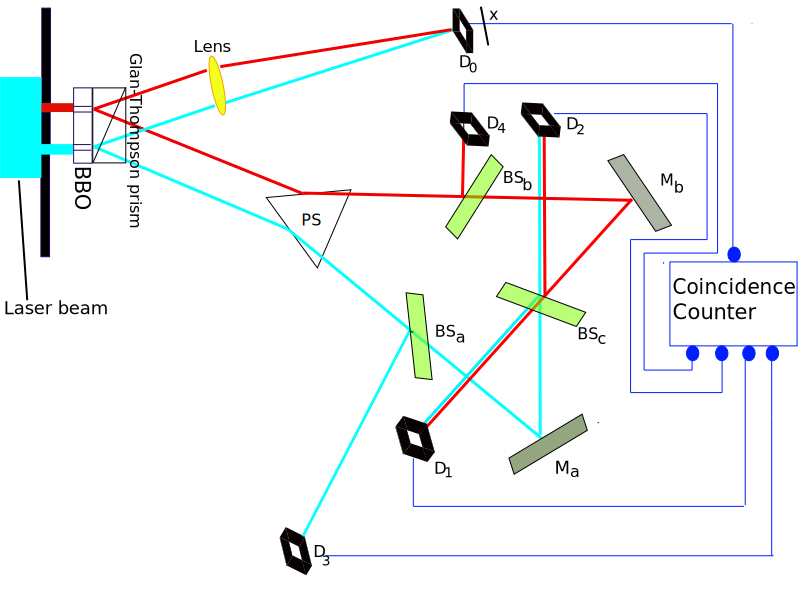
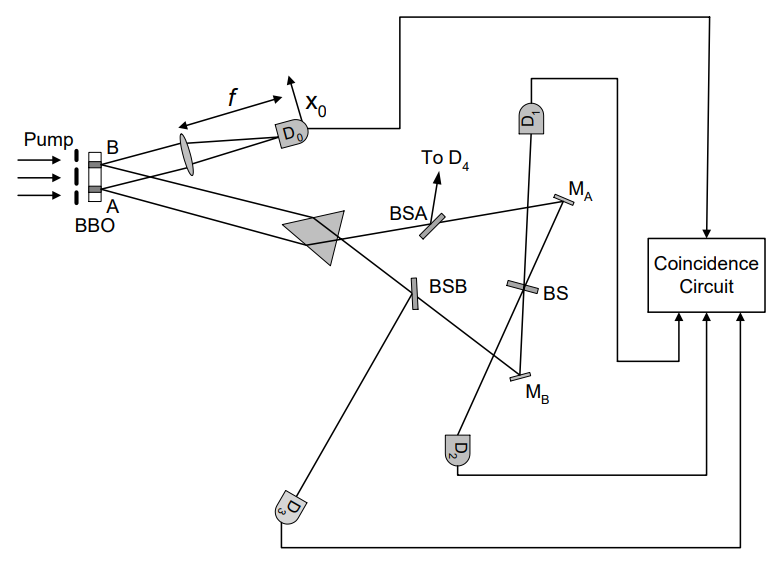
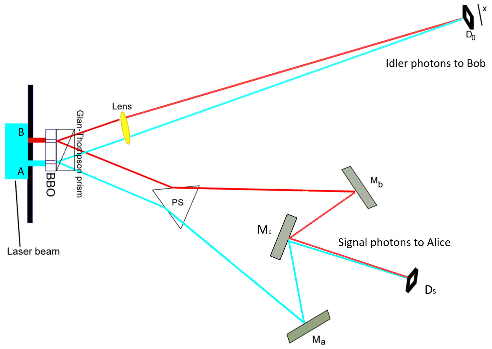
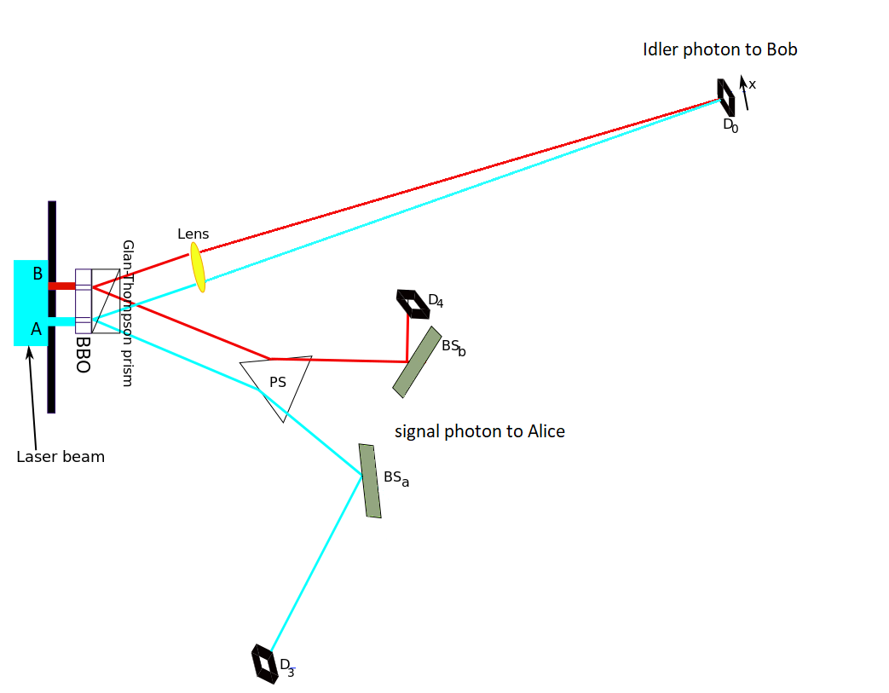
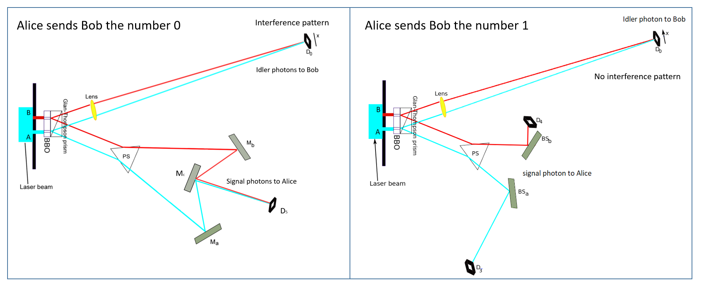

# Faster-than-light communication?

Updated on 03.08.2021

When you see the title, you probably think that this is not gonna work, because you learned that the ultimate speed limit of the universe is the speed of light (actually every 
massless object will travel in this speed in the vaccuum). Massive object moving faster than light is impossible as shown in Einstein's special relativity. More importantly, 
moving faster than light or sending information faster than light will violate the sacred law of causality. So, you are sure that superluminal communication is never gonna 
work and it is just a waste of time to even think about it.

However, maybe you will change your mind after reading this page to the end.

Before I start to talk about the experiment setup that seems to be possible to let us communicate faster than light (FTL), I think it is beneficial for us to first understand the famous delayed choice quantum eraser ([DCQE](https://en.wikipedia.org/wiki/Delayed-choice_quantum_eraser)) experiment, because the FTL-communication setup is based on the setup and understanding of the DCQE experiment. For people who is unfamiliar with the DCQE experiment, I recommend you to watch the videos from [PBS Spacetime](https://www.youtube.com/watch?v=8ORLN_KwAgs) and from [The Science Asylum](https://www.youtube.com/watch?v=iyN27R7UDnI) first 😉

## Understanding the [DCQE](https://arxiv.org/abs/quant-ph/9903047) experiment 🤔

Figure 1: Setup of the delayed-choice quantum-eraser experiment (from [Wikipedia](https://en.wikipedia.org/wiki/Delayed-choice_quantum_eraser#/media/File:Kim_EtAl_Quantum_Eraser.svg)).

In the internet, people like to mystify the DCQE experiment by invoking retrocausality (i.e. future event can affect past event) in their explanation of the experiment's results. Actually, there are other explanations that do not invoke retrocausality (See for example the blog posts [Deflating Delayed Choice Quantum Erasure](https://algassert.com/quantum/2016/01/07/Delayed-Choice-Quantum-Erasure.html) and [A Classical Delayed Choice Experiment](https://algassert.com/post/1720); and the paper [Taming the DCQE](https://arxiv.org/abs/1707.07884)). 

Figure 2: Setup of the delayed-choice quantum-eraser experiment (from the original [paper](https://doi.org/10.1103/PhysRevLett.84.1) by Scully, Kim, Yu, Kulik, Shih). A pair of signal-idler photons is generated from either the `A` or the `B` region. The distance between the center of `A` and `B` is about 0.7 mm in the original experiment.

Here, I will just give a summary of important points about the DCQE experiment. For a more detailed explanation with a little bit more math, please read the "[paper](https://github.com/StevenLeeWW/Faster-than-light/blob/main/superluminal.pdf)" (written by me 😁) or watch this [video](https://www.youtube.com/watch?v=SiVfvtwfmAw&t=8s).

### Importants points:
1. The quantum state of the signal and the idler photon is entangled due to the conservation laws such as conservation of energy and momentum.
2. Joint measurements were made, i.e. the measurement results are only kept if both the signal photons and their entangled idler photons are detected.
3. In this setup, one can never directly see an interference pattern formed by the signal photons on the detector `D0` without grouping the dots based on where the idler photons are detected.
4. One can only see the interference patterns **after** the detection locations of the signal photons are **grouped** according to where the entangled idler photons get detected (either `D1` or `D2`).
5. The interference patterns are phase-shifted from each other such that the bright fringes of one interference pattern line up with the dark fringes of the other interference pattern. Therefore, the interference patterns are not visible before the grouping is done.

### Comments about some of the points:

+ The third point is due to the availability of the which-region-information (or which-path-information) in the entangled idler photon, which means that one can (in principle) find out from which region (`A` or `B`) of the BBO crystal the signal-idler pair came from by carrying out some suitable measurements on the idler photon. 
> This availablity of the which-region-infomation makes the wavefunction of the signal photon unable to produce interference pattern, **REGARDLESS** of where the entangled idler photons end up later! (See section 3.3 in this "[paper](https://github.com/StevenLeeWW/Faster-than-light/blob/main/superluminal.pdf)" for more math details)

+ One might then ask: how do the interference patterns reappear when the idler photons are detected at `D1` and `D2`? 
The short answer is: They DON'T.  
> + The longer answer is: The interference patterns only "reappear" if the idler photons are detected at `D1` and `D2`, AND **AFTER** the detection locations of the signal photons are **GROUPED** based on where (`D1` or `D2`) the idler photons are detected.
> + DO NOT forget that interference can also occur for the wave function of the IDLER photon at the last beam splitter `BS`!

+ The fifth point (the pi-phase-shift) is due to the unitary operation of the beam splitter on the wave function of the idler photon (see the MIT OCW [video](https://www.youtube.com/watch?v=0USje5vTIKs) about the matrix representation of the unitary operation of the beam splitter; and section 3.6 of this "[paper](https://github.com/StevenLeeWW/Faster-than-light/blob/main/superluminal.pdf)").

### A small conclusion for the DCQE experiment before we talk about the FTL communication

1. No retrocausality is needed to explain the results of the DCQE experiment.
2. The absence of the interference pattern for the signal photons is due to the availability of the which-region-information encoded in the entangled idler photons, making the wavefunction of the signal photon unable to produce interference pattern, and this is **INDEPENDENT** of where the idler photons will end up **later**.

## Modification to the DCQE experiment that makes FTL-communication possible? 🤔

Now let's say that the signal photons are sent to Alice and the idler photons are sent to Bob. Assume that the distance between the BBO crystal and Alice is **shorter** than the distance between the BBO crystal and Bob, therefore the signal photon will reach Alice **before** the idler photon reaches Bob.

Figure 3: Schematic diagram of the one of the setup that might make FTL-communication possible. The signal photons will reach Alice earlier than the idler photons reach Bob. In this configuation, Alice chooses to **delete** the which-region-information carried by the signal photon before the idler photon reaches Bob's detector `D0`.

From Figure 3, we can see that the two possible paths of the signal photon is combined into a single path using a few mirrors. The signal photon is detected by detector `D5` before Bob's idler photon can reach detector `D0`. The detector `D5` can be an atom inside a cavity. When the signal photon is absorbed by the atom, the atom transitions from a lower energy state to a higher energy state, and later spontaneously reemits the energy as radiation in random direction, effectively delete the which-region-information that one can obtain from the signal photon. 

After this, the wave function of the idler photon travelling to Bob should be able to produce interference pattern because now the which-region-information carried by the signal photon is deleted. If this process is repeated many many times, Bob should be able to see an interference pattern with detector `D0`. For those who would like to see the math, please kindly read this "[paper](https://github.com/StevenLeeWW/Faster-than-light/blob/main/superluminal.pdf)". 😎

On the other hand, if Alice choose not to delete the which-region-information carried by the signal photon, but to obtain the information, she can do so by using the setup illustrated in Figure 4.

Figure 4: Schematic diagram of the one of the setup that might make FTL-communication possible. The signal photons will reach Alice earlier than the idler photons reach Bob. In this configuration, Alice chooses to **obtain** the which-region-information carried by the signal photon before the idler photon reaches Bob's detector `D0`.

If the signal photon is detected by detector `D3`, then Alice knows that the signal-idler pair came from region `A`. If the signal photon is detected by detector `D4`, then Alice knows that the signal-idler pair came from region `B`. Since the which-region-information can be known now, the state of the idler photon heading to Bob is no longer a superposition state. Therefore, Bob will not see an interference pattern.

### What does this implies?

Alice and Bob can agree beforehand that if Bob sees an interference pattern with `D0`, it means Alice sends the number `0` to Bob, and if he does not see an interference pattern, it means Alice sends him the number `1`. They know that there will be enough signal-idler-pairs generated in one minute such that Bob can see clearly whether an interference pattern is present, and therefore agreed that every minute Bob will clear the pattern recorded by `D0` after checking whether an interference pattern has formed, and Alice will send a new number (`0` or `1`) to Bob. 

Figure 5: Possible scheme for superluminal communication.

Again, for those who would like to see some math, please kindly read this "[paper](https://github.com/StevenLeeWW/Faster-than-light/blob/main/superluminal.pdf)".

By using this method, Alice and Bob seem to be able to communicate using quantum entanglement, which violates the [no-communication-theorem](https://en.wikipedia.org/wiki/No-communication_theorem) (a.k.a. no-signaling-theorem). If the setup is arranged in such a way that the BBO crystal in located between Alice and Bob, and light sent by Alice will take a longer time to travel from Alice to Bob than the light from the BBO crystal to Alice and Bob, then the communication between Alice and Bob using this method will become a faster-than-light (FTL) communication (a.k.a. superluminal communication), which again will cause a lot of troubles to physics... 😱

So, what do you think? Do you think that this is possible? If not, why? I am very curious to know the reason. Feel free to tell me about your answers and comments through [Facebook](https://www.facebook.com/StevenLeeWenWu/) messenger 😉

&copy; Copyright 2021, Lee Wen Wu, Last updated on Aug 03, 2021.
